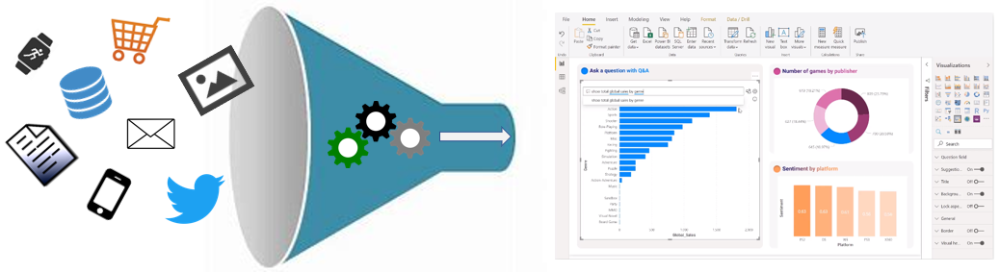
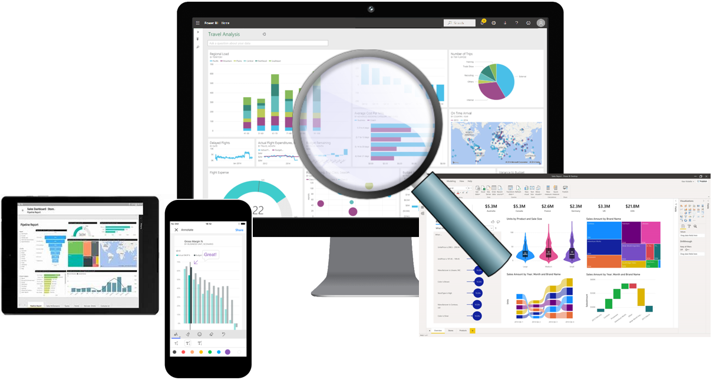

# Data Analyst
```bash
As a data analyst, you are on a journey. Think about
all the data that is being generated each day and 
that is available in an organization, from 
transactional data in a traditional database, 
telemetry data from services that you use, to signals 
that you get from different areas like social media.
```


# Overview of data analysis
```bash
Data analysis is the process of identifying, cleaning, transforming, 
and modeling data to discover meaningful and useful information.
The data is then crafted into a story through reports for 
analysis to support the critical decision-making process.
```


```bash
Data-driven businesses make decisions based on the story 
that their data tells, and in today's data-driven world,
data is not being used to its full potential, a challenge
that most businesses face. Data analysis is, and should
be, a critical aspect of all organizations to help determine 
the impact to their business, including evaluating customer 
sentiment, performing market and product research, and 
identifying trends or other data insights.
```
```bash
While the process of data analysis focuses on the tasks of cleaning,
 modeling, and visualizing data, the concept of data analysis 
 and its importance to business should not be understated. 
 To analyze data, core components of analytics are
divided into the following categories:
```
- Descriptive
- Diagnostic
- Predictive
- Prescriptive
- Cognitive

# Descriptive analytics
```bash
Descriptive analytics help answer questions about 
what has happened based on historical data. 
Descriptive analytics techniques summarize large semantic models 
to describe outcomes to stakeholders.

By developing key performance indicators (KPIs), 
these strategies can help track the success or failure of key objectives.
Metrics such as return on investment (ROI) are used in many industries, 
and specialized metrics are developed to track performance in specific industries.

An example of descriptive analytics is generating 
reports to provide a view of an organization's sales
```
# Diagnostic analytics
```bash
Diagnostic analytics help answer questions about why events happened.
Diagnostic analytics techniques supplement basic descriptive analytics,
and they use the findings from descriptive analytics to discover
the cause of these events. Then, performance indicators are
further investigated to discover why these events improved
or became worse. Generally, this process occurs in three steps:

Identify anomalies in the data. These anomalies might be unexpected changes in a metric or a particular market.

Collect data that's related to these anomalies.

Use statistical techniques to discover relationships and trends that explain these anomalies.
```
# Predictive analytics
```bash
Predictive analytics help answer questions about what will happen in the future.
Predictive analytics techniques use historical data to identify trends
and determine if they're likely to recur. Predictive analytical tools
provide valuable insight into what might happen in the future. 
Techniques include a variety of statistical and machine learning 
techniques such as neural networks, decision trees, and regression.

```
# Prescriptive analytics
```bash
Prescriptive analytics help answer questions about which 
actions should be taken to achieve a goal or target. 
By using insights from prescriptive analytics, organizations can 
make data-driven decisions. This technique allows businesses to make 
informed decisions in the face of uncertainty. Prescriptive analytics 
techniques rely on machine learning as one of the strategies to find 
patterns in large semantic models. By analyzing past decisions and events, 
organizations can estimate the likelihood of different outcomes.
```
# Cognitive analytics
```bash
Cognitive analytics attempt to draw inferences from existing data and patterns,
derive conclusions based on existing knowledge bases, and then add these 
findings back into the knowledge base for future inferences, a self-learning 
feedback loop. Cognitive analytics help you learn what might happen if 
circumstances change and determine how you might handle these situations.

Inferences aren't structured queries based on a rules database; rather,
they're unstructured hypotheses that are gathered from several sources 
and expressed with varying degrees of confidence. Effective cognitive 
analytics depend on machine learning algorithms, and will use 
several natural language processing concepts to make sense of previously 
untapped data sources, such as call center conversation logs and product reviews
```

Next Day - https://learn.microsoft.com/en-us/training/modules/data-analytics-microsoft/3-roles

